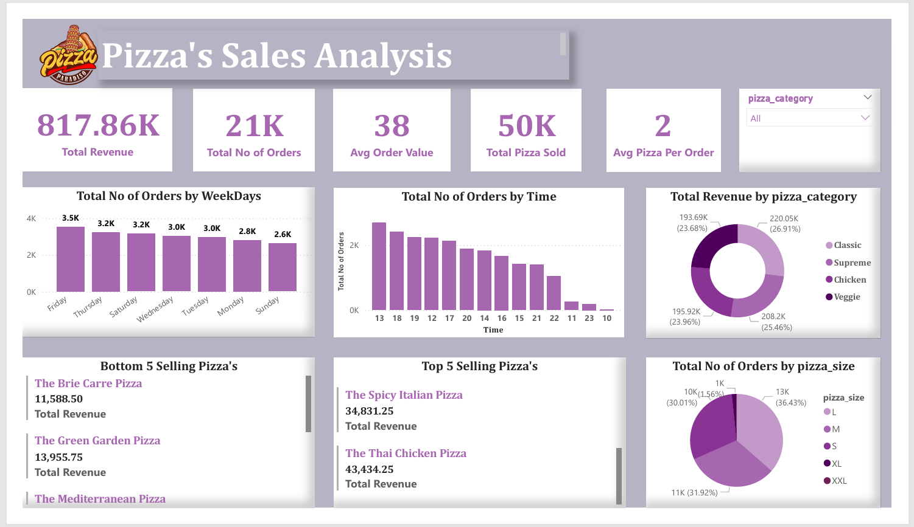

# 🍕 Pizza Sales Analysis Dashboard



## 📊 Project Overview

This project presents an end-to-end **Pizza Sales Analysis** using SQL and Power BI. It demonstrates how raw data can be transformed into actionable insights using structured queries and visual storytelling.

The analysis was performed on a pizza sales dataset sourced from Kaggle. The aim was to uncover key trends, customer behaviors, and performance metrics that could help stakeholders make data-driven decisions in the food and beverage industry.

---

## 📁 Project Structure

```
Pizza-Sales-Analysis/
│
├── 📄 Pizza_Sales_Analysis.pdf       → Final project report and summary
├── 📁 Pizza_Sales_Data/                          → Folder containing all CSV data files
│   ├── orders.csv
│   ├── order_details.csv
│   ├── pizzas.csv
│   └── pizza_types.csv
│
├── 📄 queries.txt                   → List of business questions solved
├── 📄 schema.sql                    → SQL code to create database schema
├── 📄 SQL_Pizza_Sales_Analysiss.sql          → SQL queries used for data analysis
└── 📄 README.md                     → Project documentation (this file)
```

---

## 🎯 Objectives

**SQL-based Measures:**
1. Total Revenue
2. Total Number of Orders
3. Average Order Value
4. Total Pizzas Sold
5. Average Pizzas Per Order

**Power BI Visualizations:**
- 📅 Orders by Weekday – Bar Chart
- ⏰ Orders by Hour – Bar Chart
- 🍕 Revenue by Pizza Category – Donut Chart
- 🔻 Bottom 5 Selling Pizzas – Multi-Card Visual
- 🔝 Top 5 Selling Pizzas – Multi-Card Visual
- 📏 Orders by Pizza Size – Pie Chart

---

## 🧠 SQL Highlights

Below are some sample SQL queries used during analysis:

```sql
-- Total number of orders
SELECT COUNT(order_id) AS total_orders FROM orders;

-- Total revenue from pizza sales
SELECT ROUND(SUM(order_details.quantity * pizzas.price), 2) AS total_sales
FROM order_details
JOIN pizzas ON pizzas.pizza_id = order_details.pizza_id;

-- Top 3 revenue-generating pizzas per category
SELECT name, revenue FROM (
    SELECT category, name, revenue,
    RANK() OVER (PARTITION BY category ORDER BY revenue DESC) AS rn
    FROM (
        SELECT pizza_types.category, pizza_types.name,
               SUM(order_details.quantity * pizzas.price) AS revenue
        FROM pizza_types
        JOIN pizzas ON pizza_types.pizza_type_id = pizzas.pizza_type_id
        JOIN order_details ON order_details.pizza_id = pizzas.pizza_id
        GROUP BY pizza_types.category, pizza_types.name
    ) AS a
) AS b
WHERE rn <= 3;
```

Full list of queries is available in the `SQL_Pizza_Sales_Analysis.sql` file.

---

## 🧰 Tools & Technologies Used

| Tool/Tech       | Description                                      |
|----------------|--------------------------------------------------|
| **SQL**        | For querying and data wrangling                  |
| **Power BI**   | For interactive data visualization               |
| **Windows 11** | OS used during development                       |
| **CSV Files**  | Format of the raw dataset                        |
| **Git & GitHub** | Version control and project sharing             |

---

## 📈 Techniques Applied

- Data Cleaning and Preprocessing (CSV, SQL Joins)
- Exploratory Data Analysis (EDA)
- Window Functions & Aggregations in SQL
- Data Visualization with Power BI
- Business Metric Derivation (Revenue, Order Volume, AOV)
- Category-based and Time-based Trend Analysis

---

## 📌 Insights Gained

- **Friday** is the highest order volume day—potential for promotions.
- **13:00 hrs** is peak ordering time—ideal for marketing strategies.
- **L-size pizzas** are most ordered, indicating customer preference.
- **Veggie** and **Chicken** pizzas lead in revenue contributions.
- **Bottom 5 pizzas** underperform and may need rebranding.

---

## 🚀 How to Use

1. Clone the repository:
```bash
git clone https://github.com/yourusername/Pizza-Sales-Analysis.git
```
2. Load the `.sql` files into your SQL client (e.g., MySQL Workbench).
3. Open Power BI and import the CSV data to recreate the dashboard visuals.


## Author
Vaibhavi Sanjay Kalmegh
📍 G.V.I.S.H., Amravati
🎓 M.Sc. in Statistics (2023) 
Follow me on:  
🔗 [GitHub](https://github.com/vaibhavikalmegh)  
🔗 [LinkedIn](https://www.linkedin.com/in/vaibhavikalmegh18)
